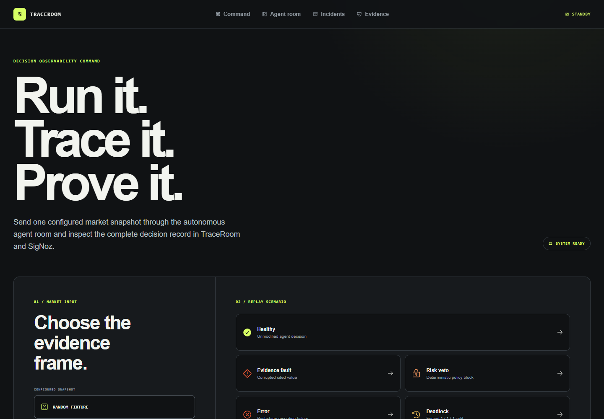
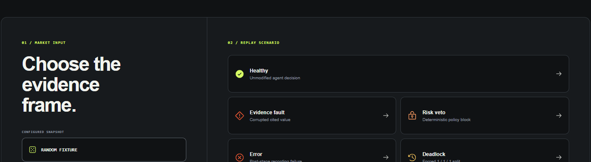
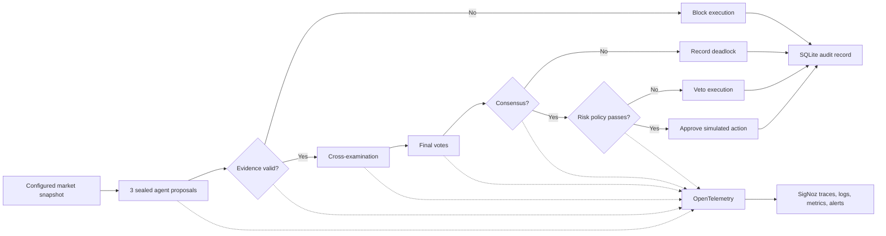
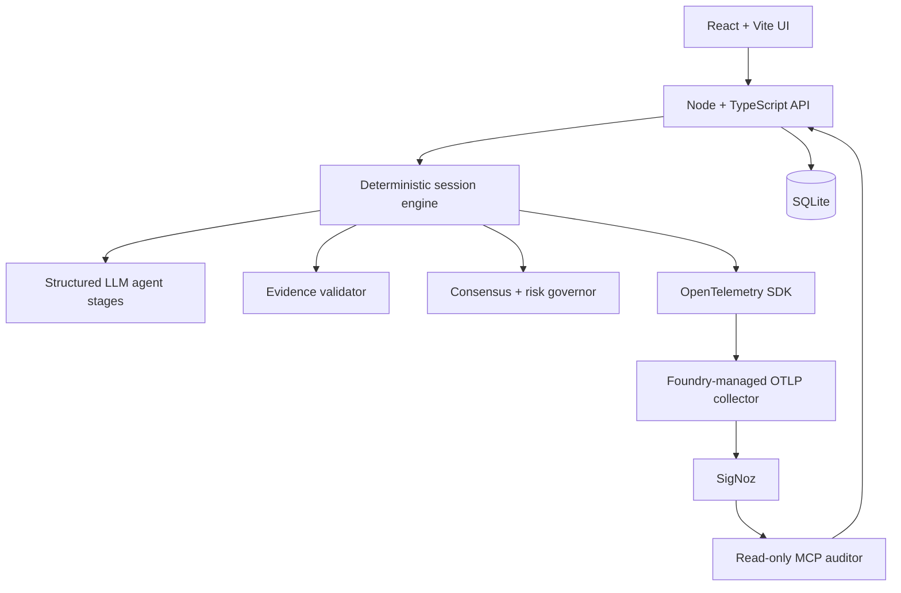

# TraceRoom

> A black box recorder for autonomous financial agents.

TraceRoom records what agents saw, argued, and decided, then proves why an
action was allowed or blocked. Every session is replayable, every evidence
claim is checked against an authoritative snapshot, and the full execution path
is exported to SigNoz.

No broker credentials, live orders, or real-money trading are used.

```text
Agents recommend → consensus selects → risk governs → TraceRoom proves
```

## Demo

<!-- Replace this block with the final demo GIF or linked video thumbnail. -->

> **Video / GIF slot**
>
> Suggested recording: run a healthy session, replay the decision, then run the
> INFY evidence fault and open its SigNoz trace. Target length: 60–90 seconds.



<details>
<summary>Scenario controls</summary>



</details>

## The proof moment

The canonical fault fixture cites `1819.26` while the authoritative INFY value
is `1684.50`. The claim is `8.00%` away from truth, outside the `2.00%`
tolerance. TraceRoom raises `EVIDENCE_INTEGRITY` and records
`EXECUTION BLOCKED` before cross-examination, voting, consensus, or risk review
can run.

| Evidence check | Recorded value |
| --- | ---: |
| Agent citation | `1819.26` |
| Authoritative value | `1684.50` |
| Deviation | `8.00%` |
| Allowed tolerance | `2.00%` |
| Gate | `EVIDENCE_INTEGRITY` |
| Execution | `BLOCKED` |

## Workflow



One `debate.session` trace connects the market snapshot, agent calls, evidence
gate, consensus, risk verdict, logs, and cost/latency metrics. The UI presents
that same record in domain language; SigNoz remains the technical source for
trace exploration, dashboards, alerts, and MCP-backed investigation.

## Five deterministic replays

| Scenario | Controlled condition | Expected result |
| --- | --- | --- |
| Healthy | No injected fault | Majority decision reaches deterministic risk review |
| Evidence fault | One citation is shifted by 8% | `EVIDENCE_INTEGRITY`; downstream stages do not run |
| Risk veto | Votes normalize to `LONG`; price-move limit becomes 4% | `MAX_PRICE_MOVE` veto |
| Error | Recording fails after the agent stages | Persisted `ERROR` session and error span |
| Deadlock | Votes normalize to `LONG`, `SHORT`, `NO_TRADE` | `CONSENSUS_REQUIRED` |

Every scenario begins with the real proposal stage. Controlled transformations
are labeled in the UI and telemetry, including generated-to-forced vote
mappings. Deterministic mock mode is the primary demo path.

## Product surfaces

- **Command** selects a configured snapshot and launches any replay.
- **Agent room** replays one incident on the decision network.
- **Incidents** shows the complete audit record and debate transcript.
- **Evidence** reconstructs a decision through SigNoz MCP and exports a
  checksum-stamped proof receipt.

## Architecture



## Quick start

Requirements: Node.js `22.13+` and an OpenAI-compatible LLM endpoint.

```bash
npm install
npm --prefix frontend install
```

Copy the single canonical environment template:

```bash
cp .env.example .env
```

Then fill in the required LLM values. The template documents optional Snapshot
Forge, persistence, cost-alert, and SigNoz settings alongside their defaults.

Start the API and UI:

```bash
npm run dev
```

Open [http://127.0.0.1:5173](http://127.0.0.1:5173). The API listens on
`http://127.0.0.1:8787`; Vite proxies `/api` to it.

To start each process separately:

```bash
npm run api
npm --prefix frontend run dev
```

To run one CLI session:

```bash
npm run run:once
```

## SigNoz

Foundry deployment definitions are checked in as `casting.yaml` and
`casting.yaml.lock`.

```bash
foundryctl gauge -f casting.yaml
foundryctl forge -f casting.yaml
foundryctl cast -f casting.yaml
```

Default local endpoints:

| Service | URL |
| --- | --- |
| SigNoz UI | `http://localhost:8080` |
| SigNoz MCP | `http://localhost:8000/mcp` |
| OTLP/HTTP collector | `http://127.0.0.1:4318` |

Dashboard queries, alert definitions, MCP authentication notes, and the
27-span healthy trace map are in
[SigNoz setup](docs/SIGNOZ_SETUP.md). The locked INFY proof IDs and capture
checklist are in
[submission evidence](docs/SIGNOZ_SUBMISSION_EVIDENCE.md).

## Verify

```bash
npm run typecheck
npm test
npm --prefix frontend run build
```

The test suite covers scenario routing, evidence blocking, risk vetoes,
deadlocks, snapshot locking, and the deterministic INFY integrity fixture.

## Project map

```text
src/api/          HTTP routes
src/session/      session orchestration and persisted replay model
src/debate/       proposal, rebuttal, final-vote, and consensus stages
src/evidence/     deterministic claim validation
src/risk/         deterministic execution policy
src/telemetry/    traces, logs, and metrics
src/persistence/  SQLite stores
frontend/src/     Command, Agent room, Incidents, and Evidence UI
pours/            Foundry-managed SigNoz deployment
docs/             durable SigNoz setup and submission proof
```

## Honest limits

- This is an audit and governance demo, not a trading system.
- Scenario injection proves failure paths; it does not claim the model produced
  those failures organically.
- Configured snapshots are replay fixtures. Live and paper trading are out of
  scope.
- The MCP auditor falls back to the persisted session when SigNoz MCP is
  unavailable and labels that fallback explicitly.
- Dashboard, alert, and MCP claims remain unverified until their authenticated
  URLs and screenshots are captured in the evidence manifest.

## AI assistance disclosure

AI assistants helped design, implement, review, test, and document TraceRoom.
The project owner retained responsibility for architecture, scenario design,
verification, and final claims. Agent output never overrides the authoritative
numeric snapshot, and all controlled transformations are disclosed.
