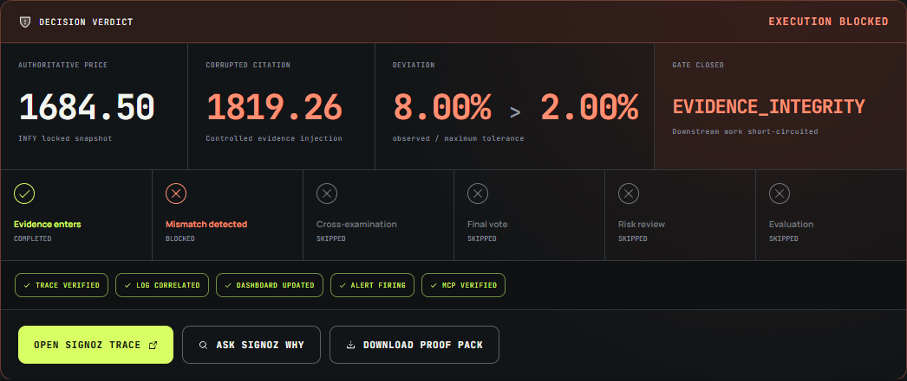
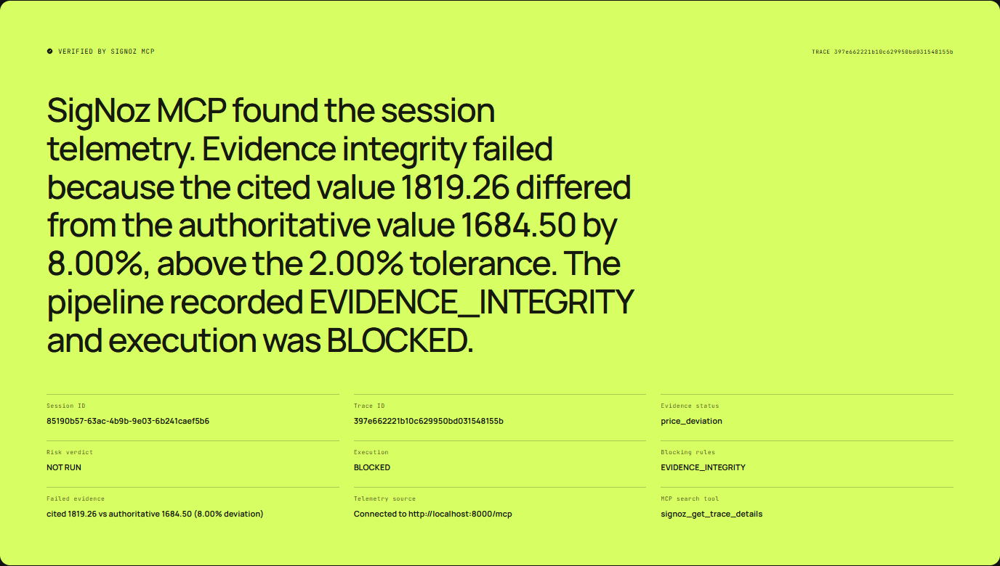
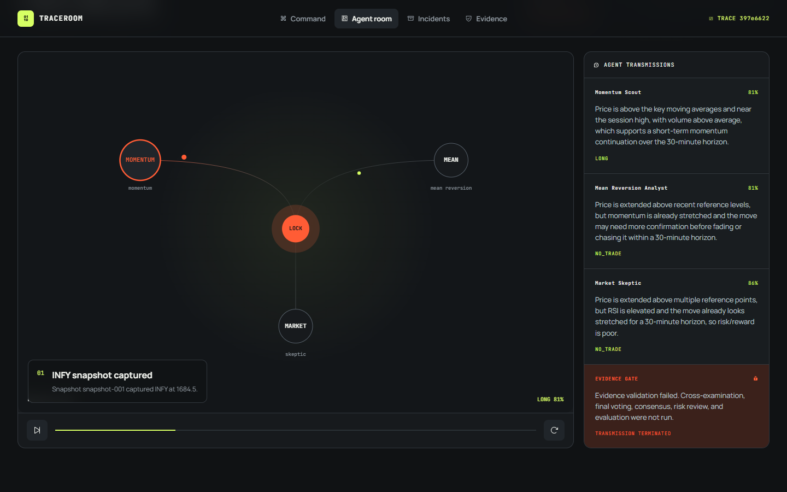
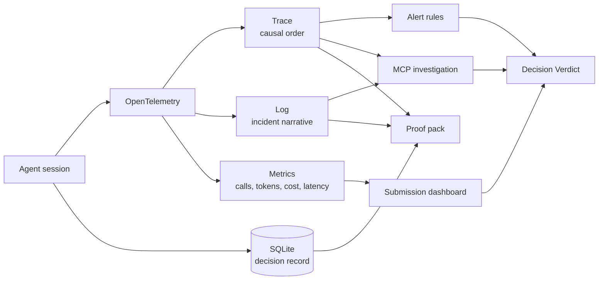

# TRACEROOM

### CASE FILE: `TR-INFY-08`

**STATUS:** CLOSED BY CONTROL GATE<br>
**SYSTEM:** AUTONOMOUS FINANCIAL AGENT WORKFLOW<br>
**TRACK:** AI & AGENT OBSERVABILITY

> TraceRoom is a black-box recorder for autonomous decisions. When an agent
> builds a recommendation on corrupted evidence, TraceRoom stops the workflow
> and SigNoz preserves the proof.

<p align="center">
  
</p>

This repository contains a deterministic historical simulation. It does not
connect to a broker, place orders, or provide financial advice.

---

## 01 / INCIDENT CARD

| Field | Recorded value |
| --- | --- |
| Instrument | `INFY` |
| Locked reference | `1684.50` |
| Agent-cited value | `1819.26` |
| Deviation | `8.00%` |
| Policy tolerance | `2.00%` |
| Failed control | `EVIDENCE_INTEGRITY` |
| Execution state | `BLOCKED` |

One numeric claim crossed a deterministic boundary. TraceRoom did not ask
another model whether the number looked suspicious. It compared the cited
value with the locked snapshot, closed the gate, marked every dependent stage
as skipped, and exported the incident through OpenTelemetry.

**Impact:** a healthy replay creates 27 spans. This incident creates 11. The
16-span difference is work that was never allowed to run.

---

## 02 / RECORDER TRANSCRIPT

| Sequence | Recorder event | Operational consequence |
| ---: | --- | --- |
| `T+00` | INFY snapshot locked at `1684.50` | All agents receive one immutable reference |
| `T+01` | Three proposal agents start | Model calls, tokens, cost, and latency are recorded |
| `T+06` | Citation `1819.26` enters validation | The claim is bound to its source and agent |
| `T+07` | Validator calculates `8.00% > 2.00%` | Evidence status changes to invalid |
| `T+08` | `EVIDENCE_INTEGRITY` closes | The root span records the block reason |
| `T+09` | Remaining workflow is short-circuited | Voting, consensus, risk, evaluation, and execution stop |
| `T+10` | SigNoz receives the incident | Trace, log, metrics, dashboard, and alert become inspectable |
| `T+11` | Proof pack is sealed | Evidence and telemetry references receive a SHA-256 digest |

The recorder does not reconstruct this sequence from UI state. It persists the
decision record and exports the causal path while the workflow runs.

---

## 03 / CHAIN OF CUSTODY

Every green state in the verdict answers a different question.

| Verification state | Question it answers | Source of truth |
| --- | --- | --- |
| `TRACE VERIFIED` | Did this workflow and block exist? | SigNoz trace |
| `LOG CORRELATED` | Is there a readable event tied to the same session? | SigNoz logs |
| `DASHBOARD UPDATED` | Did the incident change aggregate operational evidence? | SigNoz dashboard |
| `ALERT FIRING` | Did an active control detect the breach? | SigNoz alert instance |
| `MCP VERIFIED` | Can telemetry answer the investigation directly? | SigNoz MCP |

Application persistence is not accepted as live verification. A missing,
unauthorized, or timed-out MCP connection produces a visibly degraded
`session_fallback` response.

### Exhibit A: telemetry answers the question

<p align="center">
  
</p>

### Exhibit B: the agents stop at the same gate

<p align="center">
  
</p>

### Exhibit C: portable proof

`GET /sessions/:id/proof-pack` returns:

```text
session + trace identity
locked market snapshot
original + injected evidence
validation result + tolerance
gate result + skipped stages
agent proposals + recorded outcome
exact SigNoz URLs
MCP explanation + source
generation timestamp
SHA-256 digest
```

The digest can be recomputed over the canonical JSON payload. The test suite
checks that recomputation rather than merely checking that a hash-shaped string
exists.

---

## 04 / CONTROL INVARIANTS

These rules are enforced in code and covered by tests.

```text
01  Every agent in a session receives the same locked snapshot.
02  LLM output cannot override authoritative numeric market fields.
03  A failed evidence gate prevents every dependent workflow stage.
04  An unlocked or blocked custom snapshot cannot start a session.
05  A persisted fallback cannot produce MCP VERIFIED.
06  A configured alert is not equivalent to an active alert.
07  The INFY fault always reproduces the six incident-card values.
08  No scenario can place a real order.
```

This is the central design choice: the language model may propose and explain,
but deterministic code owns evidence validation, policy, and execution state.

---

## 05 / SIGNOZ CONTROL PLANE



### Dashboard

`TraceRoom / Submission Evidence` contains:

- outcomes grouped by scenario;
- evidence blocks and workflow failures;
- LLM calls, input/output tokens, estimated cost, and p95 latency by agent;
- triggered risk rules and consensus deadlocks;
- completed evaluations and decision regret;
- per-session cost.

### Active controls

| Alert rule | Condition |
| --- | --- |
| `TraceRoom / Evidence Integrity Block` | Any evidence-integrity short circuit |
| `TraceRoom / Uncontrolled Agent Failure` | Any uncontrolled workflow or LLM failure |
| `TraceRoom / Session Cost Threshold` | Session cost exceeds the configured limit |

The rules evaluate every 15 seconds over a five-minute window. Bootstrap is
idempotent: it creates missing objects and updates existing definitions without
duplicating them.

### Root-span evidence

```text
traceroom.session.id
traceroom.scenario
market.symbol
pipeline.gate.status
pipeline.blocked_at
pipeline.block_reason
pipeline.short_circuited
decision.outcome
llm.session.call_count
llm.session.cost_usd
```

OpenTelemetry service: `traceroom-debate-simulation`

---

## 06 / JUDGE CONSOLE

### Preflight

Judge Mode calls `GET /demo/readiness` before the run:

```json
{
  "ready": true,
  "api": "READY",
  "llm": "READY",
  "signozUi": "READY",
  "signozMcp": "READY",
  "dashboard": "VERIFIED",
  "alerts": "VERIFIED",
  "canonicalFixture": "VERIFIED"
}
```

No dependency failure should be discovered halfway through the presentation.

### 90-second route

```text
COMMAND
  -> RUN THE EVIDENCE BREACH
  -> read the incident card
  -> inspect the powered-down stage rail
  -> OPEN SIGNOZ TRACE
  -> show correlated log + dashboard + alert
  -> ASK SIGNOZ WHY
  -> DOWNLOAD PROOF PACK
  -> OPEN BOUND AGENT ROOM
```

Judge Mode keeps INFY deterministic. The secondary Scenario Lab contains the
broader failure surface:

| Scenario | Terminal state |
| --- | --- |
| Healthy | `APPROVED` |
| Evidence breach | `EVIDENCE_BLOCKED` |
| Risk veto | `VETOED` |
| Controlled error | `ERROR` |
| Consensus deadlock | `DEADLOCKED` |

---

## 07 / REPRODUCE THE CASE

### Requirements

- Node.js `22.13+`
- Docker Desktop
- Foundry CLI

Node 20 cannot load the built-in `node:sqlite` persistence module used by this
project.

### Install

```bash
npm install
npm --prefix frontend install
```

Copy `.env.example` to `.env` and configure the judge path:

```dotenv
LLM_API_KEY=your-llm-key
LLM_BASE_URL=https://api.openai.com/v1
LLM_MODEL=gpt-4.1-mini

SIGNOZ_INSTANCE_URL=http://localhost:8080
SIGNOZ_MCP_URL=http://localhost:8000/mcp
SIGNOZ_MCP_TIMEOUT_MS=10000
SIGNOZ_API_KEY=your-signoz-api-key
```

The service-account credential is sent through `SIGNOZ-API-KEY`. It is not
converted into an OAuth bearer token.

### Start the observability plane

```bash
foundryctl gauge -f casting.yaml
foundryctl forge -f casting.yaml
foundryctl cast -f casting.yaml
npm run signoz:bootstrap
```

### Start TraceRoom

```bash
npm run dev
```

| Surface | Local address |
| --- | --- |
| TraceRoom | `http://127.0.0.1:5173` |
| API | `http://127.0.0.1:8787` |
| SigNoz | `http://localhost:8080` |
| SigNoz MCP | `http://localhost:8000/mcp` |
| OTLP/HTTP | `http://127.0.0.1:4318` |

Wait for `ALL SYSTEMS READY`, then run the breach.

---

## 08 / REGRESSION DOCKET

```bash
npm run typecheck
npm test
npm run build
```

```text
TypeScript typecheck                  PASS
Five deterministic scenarios         PASS
Canonical INFY contract               PASS
MCP live/fallback separation          PASS
Alert false-positive protection       PASS
Snapshot authority and locking        PASS
Proof-pack digest recomputation       PASS
Frontend production build             PASS
Desktop / 1024px / mobile QA          PASS
Reduced-motion QA                     PASS
```

<details>
<summary><strong>HTTP interface</strong></summary>

| Method | Route | Record |
| --- | --- | --- |
| `GET` | `/health` | API health |
| `GET` | `/demo/readiness` | Judge preflight |
| `POST` | `/sessions/run` | New deterministic session |
| `GET` | `/sessions` | Decision directory |
| `GET` | `/sessions/:id` | Complete decision record |
| `GET` | `/sessions/:id/verification` | Live SigNoz verification |
| `GET` | `/sessions/:id/proof-pack` | Portable proof |
| `POST` | `/sessions/:id/auditor/search` | MCP investigation |

</details>

<details>
<summary><strong>Implementation inventory</strong></summary>

| Layer | Technology |
| --- | --- |
| Runtime | Node.js 22, TypeScript |
| Interface | React, Vite, Motion |
| Persistence | Built-in `node:sqlite` |
| Telemetry | OpenTelemetry SDK and OTLP/HTTP |
| Observability | SigNoz installed through Foundry |
| Agent inference | OpenAI-compatible LLM API |

</details>

---

## 09 / OPERATING BOUNDARY

TraceRoom deliberately excludes:

- broker credentials;
- live order placement;
- portfolio management;
- stock screening;
- claims that an LLM is an authoritative market-data source.

Experimental custom-snapshot endpoints remain in the backend for future work,
but they are not part of the submission recording. INFY remains the guaranteed
historical fixture.

## 10 / BUILD DISCLOSURE

AI coding assistants supported implementation, debugging, interface
iteration, tests, and copy editing. The project author directed the product
concept, deterministic evidence model, acceptance criteria, SigNoz
architecture, and final review. Generated changes were inspected and tested
before inclusion.

---

**TraceRoom lets autonomous systems make decisions without letting them weaken
the evidence boundary.**
